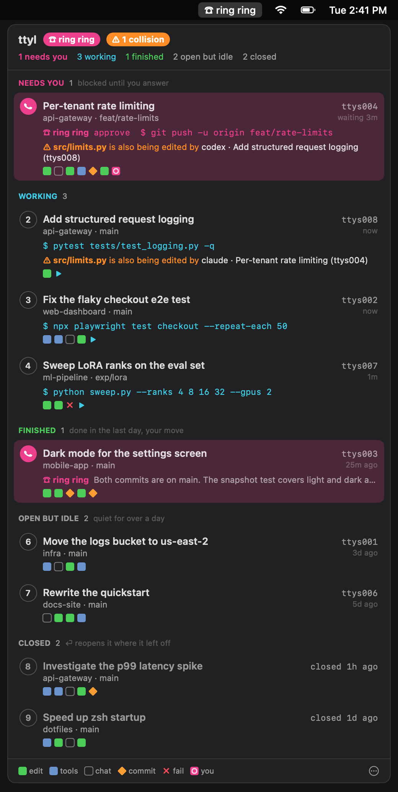
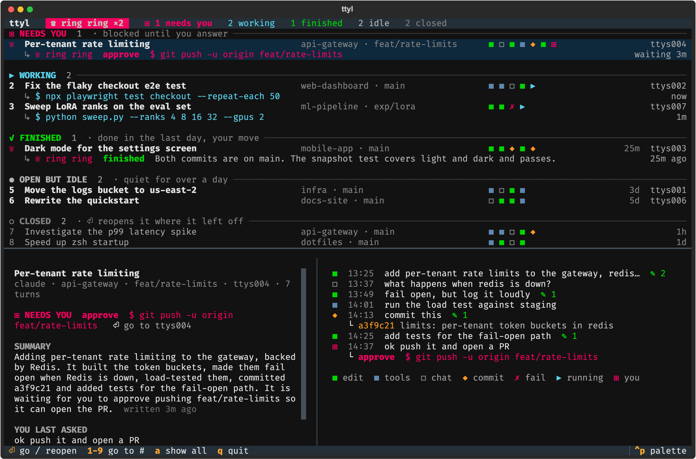
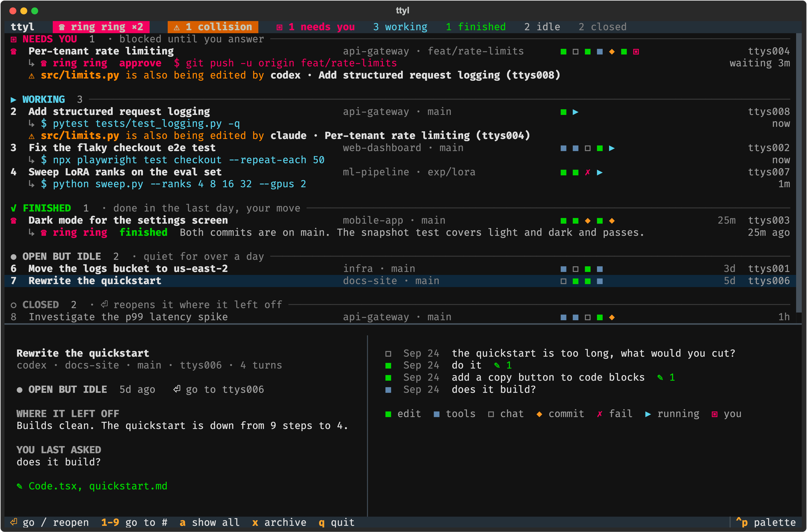

# ttyl ☎

**Your coding agents on one screen, and they call you when they need you.**
Claude Code and Codex, plus Gemini CLI, GitHub Copilot CLI, OpenCode, Goose, Aider and Qwen Code (beta), side by side.



You start Claude Code in one terminal, Codex in another, a third to fix a flaky test, a
fourth for a quick question... and an hour later you have a wall of tabs and no idea which
one is blocked on a permission prompt, which one finished, and what that one on `ttys006`
was even for.

ttyl (*talk to you later*) watches all of them. Walk away. When an agent needs you or
finishes, your menu bar says **☎ ring ring**, your Mac rings like an old phone, and one click
takes you to the right terminal.

- **Ring ring.** A session rings when it's blocked on you (a permission prompt, a question)
  or finishes its turn. It stops once you go to it.
- **Collision warnings.** "⚠ `src/limits.py` is also being edited by codex (ttys008)": when two
  sessions, from any agents, edit the same file within the hour, both get flagged and you get a
  notification. No single agent can see this; ttyl sees all of them.
- **Grouped by what they need from you:** `NEEDS YOU`, `WORKING`, `FINISHED`,
  `OPEN BUT IDLE`, `CLOSED`. Urgent ones say exactly what they want
  ("approve `git push -u origin feat/rate-limits`").
- **A square per turn**, like a commit graph for the conversation: edits, commits, failures,
  chat. Hover a square to see that turn.
- **A summary of every session** (opt-in), written by Claude and saved: the goal, what's done,
  and what it's waiting on.
- **Go there:** click a row (or press `1`–`9` in the terminal view) and the right
  Terminal / iTerm2 tab comes to the front.
- **Closed a tab by accident?** It stays on the map. Click it and it reopens in a new window,
  in the right folder, with the flags it was started with, right where it left off.
- **Zero setup:** no hooks, no wrappers. Sessions you started before installing it show up too.

## Install

One line, on macOS or Linux:

```sh
curl -fsSL https://raw.githubusercontent.com/SrinjoyDutta1/ttyl/main/install.sh | bash
```

Or, if you already use pipx or uv (needs Python 3.11+):

```sh
pipx install git+https://github.com/SrinjoyDutta1/ttyl     # or: uv tool install git+…
```

Then pick how you want it. **Both work, at the same time too:**

```sh
ttyl         # the terminal version
ttyl app     # the Mac menu bar app (macOS 14+; builds itself the first time, ~20s)
ttyl --demo  # try either on made-up sessions first
```

`ttyl app` compiles the app locally with Apple's Command Line Tools
(`xcode-select --install` if you don't have them); no Xcode project, nothing downloaded.

**AI summaries are off by default**, so nothing leaves your machine. To turn them on:

```sh
export ANTHROPIC_API_KEY=sk-ant-...   # from console.anthropic.com, in ~/.zshrc
ttyl summaries on                     # or: menu bar ☎ > ⋯ > AI summaries
```

## Use

**Menu bar:** click ☎ for the panel. Click a row to go to that terminal (or reopen it),
hover a row for its summary, hover a square for that turn. Hover a row and click the box
icon to archive it, or right-click a row for Archive / Move to Trash / Copy resume command.
`⋯` opens the full terminal view, shows all history, or plays a test ring.

**Terminal view:** `ttyl`



| key | does |
|---|---|
| `1`–`9` | go straight to that session's terminal (or reopen it, if it's closed) |
| `↑` `↓` then `⏎` | pick one, go to it / reopen it |
| `x` | archive (or unarchive) the selected session |
| `D` `D` | move a closed session to the Trash (press twice) |
| `a` | toggle recent / all history (archived sessions show up here) |
| `q` | quit |

**Commands**

```sh
ttyl ls              # print the map once
ttyl show 5          # summary + full timeline for the session on ttys005
ttyl jump api        # bring the tab for project "api…" to the front
ttyl resume 3f2a9c   # reopen a closed session (by id prefix) in a new window
ttyl summaries on    # opt in to AI summaries (off by default; `off` to stop)
ttyl summarize       # write or refresh summaries now
ttyl archive 5       # hide a session until it does something new (unarchive undoes)
ttyl delete 3f2a9c   # move a closed session's transcript to the Trash
ttyl -a              # include all history, not just the last 3 days + everything open
ttyl --quiet         # no ring sound or notifications (rows still flash)
```

Sessions can be picked by tty (`ttys005` or `5`), pid, id prefix, project name, or part of
the title.

## Reading the squares



Each square is one turn: one message from you plus everything the agent did in response,
oldest on the left.

| square | the turn… |
|---|---|
| <code>■</code> green | edited files |
| <code>■</code> blue | ran tools (shell, reads, search) but changed nothing |
| <code>□</code> | was just conversation |
| <code>◆</code> | made a git commit |
| <code>✗</code> | was interrupted or errored |
| <code>▶</code> | is running now |
| <code>▣</code> | is waiting on you |

`+27` in front means 27 older turns are hidden; `ttyl show` has them all.

## How it works

Everything comes from files your agents already write. Nothing is installed into them.

| source | gives |
|---|---|
| `~/.claude/projects/*/<session>.jsonl` | Claude Code turns, tool calls, titles, and its "while you were away" recaps |
| `~/.claude/sessions/<pid>.json` | Claude Code's live registry: which process runs which session, and whether it's busy, idle, or waiting on a permission prompt |
| `~/.codex/sessions/**/rollout-*.jsonl` | Codex turns (CLI and Desktop) and thread names |
| `ps` | which terminal (tty) each agent lives in |
| `git log` | the commits a turn actually made |

Transcripts are tailed by byte offset, so a refresh only reads what's new. ttyl keeps its own
small record in `~/.local/state/ttyl/state.json`: each session it has seen running (folder,
launch flags, when it was last alive) and its saved summary. That's what keeps a closed
terminal on the map, even one that sat idle for weeks, and lets a click bring it back with
`claude --resume <id>` (or `codex resume <id>`).

The menu bar app is a thin SwiftUI shell (`src/ttyl/gui`) over `ttyl serve`, which streams JSON
snapshots and takes commands on stdin. The same engine drives the terminal view.

### Summaries and privacy

By default everything stays on your machine: ttyl only reads files and talks to your terminal.

AI summaries are the one exception, and they're **off until you turn them on** (`ttyl summaries
on`, or the toggle in the menu bar app). When on, ttyl sends Claude (`claude-opus-5-5`, low
effort) a compact excerpt of a session (your prompts, the agent's replies, file names, commit
subjects) to write its summary, billed to your Anthropic API key (roughly 2¢ a summary). It does
this only after a session has new turns and isn't mid-turn, one session at a time, for every
agent's sessions, not just Claude's. `ttyl summaries off` stops it; `TTYL_SUMMARIES=0` or
`--no-summaries` force it off. With summaries off you see the agent's own "while you were away"
note where it wrote one.

### Support

| | map and summary | live status | click it |
|---|---|---|---|
| Claude Code | ✓ | ✓ exact, from its own registry | brings its tab forward; reopens with `claude --resume` |
| Codex Desktop | ✓ names, branches and archived state from Codex's thread index | working / finished from its log; "needs you" is a best guess* | opens the thread in the Codex app |
| Codex CLI | ✓ | best effort (process + activity) | brings its tab forward; reopens with `codex resume` |
| Gemini CLI (0.39+, older `.json` sessions too) · beta | ✓ | working / done from its log + process | brings its tab forward; reopens with `gemini --resume` |
| Qwen Code · beta | ✓ | working / done from its log + process | brings its tab forward; reopens with `qwen --resume` |
| GitHub Copilot CLI · beta | ✓ (name and branch from its workspace file) | working / done from its turn events + process | brings its tab forward; reopens with `copilot --resume=<id>` |
| OpenCode · beta | ✓ (from its SQLite database) | working / done from message completion + process | brings its tab forward; reopens with `opencode --session <id>` |
| Goose · beta | ✓ (from its SQLite database) | working / done from its messages + process | brings its tab forward; reopens with `goose session --resume` |
| Aider · beta | ✓ latest run per repo (it logs into each repo; ttyl looks in folders it knows and where aider runs) | working / done + process | brings its tab forward; reopens with `aider --restore-chat-history` |

\* Only Claude Code records that it's waiting on you. Codex doesn't log approval requests, so ttyl
treats a tool call that's been waiting 20+ seconds under an approval policy as "probably waiting
for approval". The others keep approvals in memory only: a session waiting for approval shows as
working or finished, and still rings when it stops.

**Beta** agents are built from each project's source code (Copilot's from its SDK's event types,
since the CLI is closed source) and tested against records shaped like it, but not yet against
real sessions. If one looks off, please
[report it with a redacted sample](https://github.com/SrinjoyDutta1/ttyl/issues/new?template=agent.yml);
that's the fastest way to fix it. Not supported: Cursor's CLI (chats are protobuf blobs) and Amp
(threads live on its servers).

**Collisions:** two or more sessions (at least one still open) that edited the same file in the
last hour. Paths are compared after resolving each agent's relative paths against its working
directory; the agents' own memory/plan files are ignored.

**Archive vs. delete:** archiving only hides a session in ttyl (nothing on disk changes) and it
comes back by itself if the session does anything new. Deleting moves a closed session's
transcript to your Trash, in a folder with a note saying where it came from, so you can put it
back.

Going to a tab, reopening, ringing and the menu bar app need macOS (Terminal.app or iTerm2;
the first use may ask to allow controlling Terminal). The terminal view works anywhere
Python does.

## Roadmap

- `ttyl new claude "fix the holdout test"`: start a session with its goal attached
- Answer a permission prompt from the menu bar without switching tabs
- Answer approval prompts for agents with hook APIs (Gemini CLI, Claude Code) from the menu bar

## Development

```sh
git clone https://github.com/SrinjoyDutta1/ttyl && cd ttyl
python3 -m venv .venv && .venv/bin/pip install -e '.[dev]'
.venv/bin/pytest -q
scripts/test_install.sh                   # the one-line install on a simulated brand-new Mac
ttyl app --rebuild                        # rebuild the menu bar app from src/ttyl/gui
.venv/bin/python scripts/screenshot.py    # regenerate docs/*.png from demo data
```

## License

MIT
