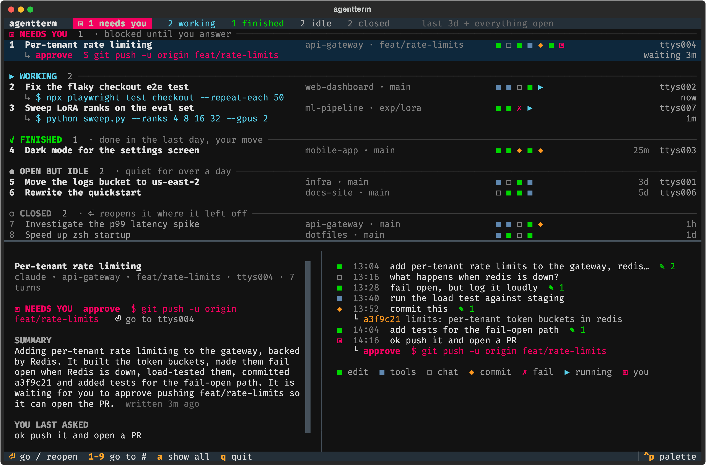
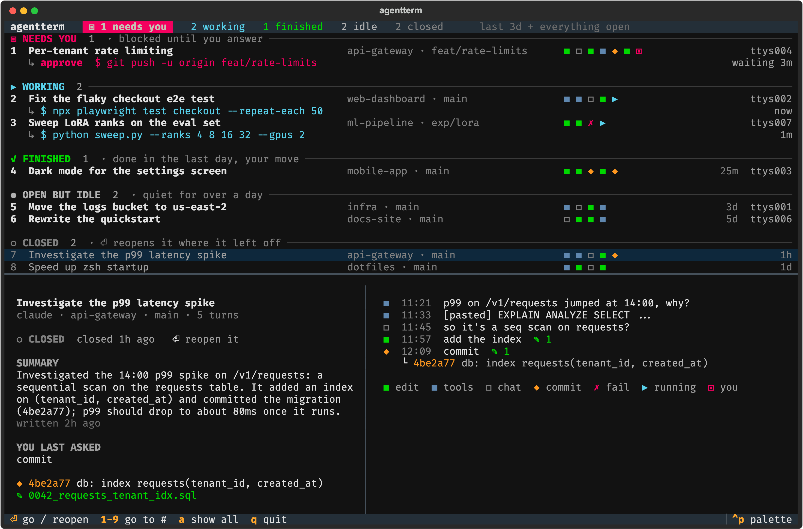

# agentterm

**A map of every coding agent you have running.** One glance tells you which terminal
needs you, what each one is doing, and where each one left off.



You start Claude Code in one terminal, Codex in another, a third to fix a flaky test, a
fourth for a quick question... and an hour later you have a wall of tabs and no idea which
one is blocked on a permission prompt, which one finished, and what that one on `ttys006`
was even for.

`agt` reads the transcripts your agents already write and turns them into one screen:

- **Grouped by what they need from you:** `NEEDS YOU`, `WORKING`, `FINISHED`,
  `OPEN BUT IDLE`, `CLOSED`. Urgent ones are on top and say exactly what they want
  ("approve `git push -u origin feat/rate-limits`").
- **A square per turn**, like a commit graph for the conversation, so you can see a
  session's shape at a glance: edits, commits, failures, chat.
- **A summary of every session**, written by Claude and saved, so "what was this one
  doing?" has a three-sentence answer: the goal, what's done, and what it's waiting on.
- **Go there:** press `1`–`9` or `⏎` and the right Terminal / iTerm2 tab comes to the front.
- **Closed a tab by accident?** It stays on the map. Press `⏎` and it reopens in a new
  window, in the right folder, with the flags it was started with, right where it left off.
- **Zero setup:** no hooks, no wrappers, no daemon. Sessions you started before installing
  it show up too.

## Install

Requires Python 3.11+.

```sh
pipx install git+https://github.com/SrinjoyDutta1/agentterm
# or
uv tool install git+https://github.com/SrinjoyDutta1/agentterm
```

Try it on made-up sessions first:

```sh
agt --demo
```

For AI summaries, give it an Anthropic API key (from
[console.anthropic.com](https://console.anthropic.com)). Everything else works without one.

```sh
export ANTHROPIC_API_KEY=sk-ant-...
```

## Use

```sh
agt                  # the live map (refreshes every 2s)
agt ls               # print it once
agt show 5           # recap + full timeline for the session on ttys005
agt jump api         # bring the tab for project "api…" to the front
agt resume 3f2a9c   # reopen a closed session (by id prefix) in a new window
agt summarize        # write or refresh summaries now (the live map does this in the background)
agt -a               # include all history, not just the last 3 days + everything open
```

Sessions can be picked by tty (`ttys005` or `5`), pid, id prefix, project name, or part of
the title.

| key | does |
|---|---|
| `1`–`9` | go straight to that session's terminal (or reopen it, if it's closed) |
| `↑` `↓` then `⏎` | pick one, go to it / reopen it |
| `a` | toggle recent / all history |
| `q` | quit |

It also sends a toast (and a bell) when a session starts needing you, finishes a turn, or
its terminal closes.

## Reading the map



| square | the turn… |
|---|---|
| <code>■</code> green | edited files |
| <code>■</code> blue | ran tools (shell, reads, search) but changed nothing |
| <code>□</code> | was just conversation |
| <code>◆</code> | made a git commit (hash and message are shown in the timeline) |
| <code>✗</code> | was interrupted or errored |
| <code>▶</code> | is running now |
| <code>▣</code> | is waiting on you |

`+27` in front of the squares means 27 older turns are scrolled off; `agt show` has them all.

## How it works

Everything comes from files your agents already write. Nothing is installed into them.

| source | gives |
|---|---|
| `~/.claude/projects/*/<session>.jsonl` | Claude Code turns, tool calls, titles, and its "while you were away" recaps |
| `~/.claude/sessions/<pid>.json` | Claude Code's live registry: which process runs which session, and whether it's busy, idle, or waiting on a permission prompt |
| `~/.codex/sessions/**/rollout-*.jsonl` | Codex turns (CLI and Desktop) and thread names |
| `ps` | which terminal (tty) each agent lives in |
| `git log` | the commits a turn actually made |

Transcripts are tailed by byte offset, so a refresh only reads what's new.

agt keeps its own small record in `~/.local/state/agentterm/state.json`: each session it has
seen running (folder, launch flags, when it was last alive) and its saved summary. That's
what keeps a closed terminal on the map, even one that sat idle for weeks, and lets `⏎`
bring it back with `claude --resume <id>` (or `codex resume <id>`).

### Summaries and privacy

Everything above stays on your machine. Summaries are the one exception: when an
Anthropic API key is available, agt sends Claude (`claude-opus-5-5`, low effort) a compact
excerpt of a session (your prompts, the agent's replies, file names, commit subjects) to write
its summary. It only does this after a session has new turns and isn't mid-turn, one session
at a time. That includes Codex sessions. Turn it off with `agt --no-summaries` or
`AGT_SUMMARIES=0`. Without a key, the recap shows the agent's own "while you were away" note
instead.

### Support

| | map and recap | live status | jump to tab |
|---|---|---|---|
| Claude Code | ✓ | ✓ exact (from its registry) | ✓ |
| Codex CLI | ✓ | best effort (process + activity) | ✓ |
| Codex Desktop | ✓ | best effort | n/a |

Jumping and reopening use AppleScript, so they need macOS with Terminal.app or iTerm2 (the
first use may ask to allow controlling Terminal). The map itself works anywhere Python does.

## Roadmap

- `agt new claude "fix the holdout test"`: start a session with its goal attached
- Set each terminal tab's title to its session's title
- More agents (Gemini CLI, Aider, Cursor's CLI)

## Development

```sh
git clone https://github.com/SrinjoyDutta1/agentterm && cd agentterm
python3 -m venv .venv && .venv/bin/pip install -e '.[dev]'
.venv/bin/pytest -q
.venv/bin/python scripts/screenshot.py   # regenerate docs/*.png from demo data
```

## License

MIT
